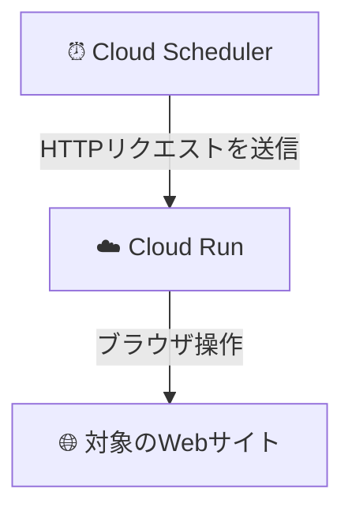

# Playwright on Cloud Run：低コストで実現するサーバーレス自動化バッチ


# はじめに

この記事は、Playwrightで作成したWeb操作スクリプトを、Google Cloud RunとCloud Schedulerを使い、低コストなサーバーレス環境で定期実行する方法を解説します。

個人的な話ですが、この記事は「**新しい記事を公開したら多くの人に見てもらいたい**」という母の願いを叶えるために、Playwrightで最新記事のPVを増やす自動化スクリプトを組んだ経験に基づいています。WEBアプリケーション以外のデプロイは初めてで、多くの学びがありました。その知見を皆さんと共有できれば幸いです。

# 構成の概要

このシステムの全体像は非常にシンプルです。

**Cloud Scheduler** が設定されたスケジュール（例：毎時0分）になると、**Cloud Run** サービスのURLに対してHTTPリクエストを送信します。リクエストを受け取ったCloud Runは、Playwrightを含むDockerコンテナを起動し、指定されたWeb操作タスクを実行します。



この構成の最大のメリットは、**コスト効率**です。Cloud Runはリクエストがあったときだけコンテナを起動（`--min-instances 0` 設定）するため、実行時間分の料金しかかからず、待機コストをほぼゼロにできます。

# 1\. 環境構築とGCPの準備

まず、開発とデプロイに必要なツールをインストールし、Google Cloudプロジェクトを設定します。

### 1\. 必要なツールのインストール

>* **Google Cloud CLI**: GCPをコマンドラインから操作するためのツールです。

https://cloud.google.com/sdk/docs/install

>* **Docker Desktop**: コンテナをビルドし、実行するためのアプリケーションです。
>* **📌 ポイント**: デプロイ作業中は、Docker Desktopを必ず起動しておいてください。

https://www.docker.com/products/docker-desktop/


### 2\. Google Cloud プロジェクトの設定

次に、gcloud CLIを使ってGCPプロジェクトの準備を進めます。

```bash
# DockerコマンドでGCR/Artifact Registryに認証
gcloud auth configure-docker

# 新しいGCPプロジェクトを作成 (your-project-idは任意の名前に変更)
gcloud projects create your-project-id

# 作成したプロジェクトをデフォルトに設定
gcloud config set project your-project-id

# 必要なAPIを有効化
# Cloud Run, Cloud Scheduler, Container RegistryのAPIを有効にします
gcloud services enable run.googleapis.com \
  cloudscheduler.googleapis.com \
  containerregistry.googleapis.com
```

-----

# 2\. アプリとDockerfileの準備

次に、Playwrightスクリプトを実行するためのアプリケーションと、それをコンテナ化するためのDockerfileを作成します。

### 1\. HTTPサーバーの実装

Cloud Runは、HTTPリクエストをトリガーとしてコンテナを起動します。そのため、Playwrightのタスクを実行する前に、リクエストを受け付けるための簡単なHTTPサーバーを実装する必要があります。

**`server.js`の実装例:**

```javascript
import http from 'http';
import { runPlaywrightTask } from './playwright-task'; // Playwrightの処理を別ファイルに記述

const PORT = process.env.PORT || 8080;

const server = http.createServer(async (req, res) => {
  // Cloud SchedulerからのPOSTリクエストを想定
  if (req.method === 'POST') {
    try {
      console.log('Starting Playwright task...');
      await runPlaywrightTask(); // Playwrightのメイン処理を実行
      console.log('Playwright task finished successfully.');
      res.writeHead(200, { 'Content-Type': 'text/plain' });
      res.end('Task executed successfully.');
    } catch (error) {
      console.error('Error during Playwright task execution:', error);
      res.writeHead(500, { 'Content-Type': 'text/plain' });
      res.end('Task failed.');
    }
  } else {
    // ヘルスチェック用（GETリクエストなど）
    res.writeHead(200, { 'Content-Type': 'text/plain' });
    res.end('Server is running.');
  }
});

server.listen(PORT, () => {
  console.log(`Server listening on port ${PORT}`);
});
```

### 2\. 依存関係の整理 (`package.json`)

`playwright`は、コンテナ内でブラウザを操作するために実行時に必要です。そのため、`devDependencies`ではなく`dependencies`に含める必要があります。

```json:package.json
{
  "dependencies": {
    "playwright": "^1.45.0", // 実行時に必須
    // その他、実行時に必要なライブラリ
  },
  "devDependencies": {
    "@playwright/test": "^1.45.0", // テストでのみ使用
    "typescript": "^5.5.4", // ビルド時にのみ使用
    "@types/node": "^22.3.0",
    // その他、開発時にのみ必要なライブラリ
  }
}
```

### 3\. Dockerfileの最適化

効率的でセキュアなコンテナをビルドするために、Dockerfileを工夫します。

```dockerfile:dockerfile
# 1. ベースイメージの選択
# 公式のPlaywrightイメージを使用することで、ブラウザ依存関係のインストール手間を省く
FROM mcr.microsoft.com/playwright:v1.45.0-jammy

# 2. 作業ディレクトリの設定
WORKDIR /app

# 3. 依存関係のインストール（キャッシュ活用）
# package*.jsonを先にコピーし、依存関係をインストールする
# これにより、コード変更時にもNPMモジュールのレイヤーキャッシュが効き、ビルドが高速化する
COPY package*.json ./
RUN npm ci

# 4. Playwrightブラウザのインストール
# --with-depsで関連パッケージも同時にインストール
RUN npx playwright install --with-deps

# 5. アプリケーションコードのコピー
COPY . .

# 6. TypeScriptのビルド (TypeScriptプロジェクトの場合)
RUN npm run build

# 7. 本番用依存関係のみを残す
# ビルドが完了したら、devDependenciesを削除してイメージサイズを削減
RUN npm prune --production

# 8. セキュリティ強化のため非rootユーザーで実行
RUN groupadd -r appuser && useradd -r -g appuser appuser
RUN chown -R appuser:appuser /app
USER appuser

# 9. ポートの公開
EXPOSE 8080

# 10. コンテナ起動コマンド
# 実装したHTTPサーバーを起動
CMD ["node", "dist/scripts/server.js"]
```

# 3\. Cloud Runへのデプロイ

準備が整ったら、ビルドしたイメージをCloud Runにデプロイします。

### 1\. デプロイスクリプト

毎回コマンドを打つのは手間なので、デプロイ用のスクリプトを作成すると便利です。以下はPowerShellの例です。

```powershell:deploy.ps1
# --- 設定項目 ---
$PROJECT_ID = "your-project-id"        # あなたのGCPプロジェクトID
$SERVICE_NAME = "playwright-cron-job"  # 任意のサービス名
$REGION = "asia-northeast1"              # デプロイするリージョン (例: 東京)
# --- 設定ここまで ---

$IMAGE_NAME = "gcr.io/$PROJECT_ID/$SERVICE_NAME"

Write-Host "🚀 Starting deployment to Google Cloud Run..." -ForegroundColor Green

# 1. Dockerイメージをビルド
docker build -t $IMAGE_NAME .
if ($LASTEXITCODE -ne 0) { throw "Docker build failed." }

# 2. Google Container Registry (GCR) にイメージをプッシュ
docker push $IMAGE_NAME
if ($LASTEXITCODE -ne 0) { throw "Docker push failed." }

# 3. Cloud Runにデプロイ
gcloud run deploy $SERVICE_NAME `
  --image $IMAGE_NAME `
  --platform managed `
  --region $REGION `
  --allow-unauthenticated `  # 動作確認のため、未認証アクセスを許可 (後述のセキュリティ注記を参照)
  --port 8080 `
  --memory 1Gi `              # Playwrightはメモリを消費するため、1GiB程度を推奨
  --cpu 1 `
  --min-instances 0 `          # コスト最適化の要！アイドル時はコンテナを0に
  --max-instances 2 `          # 意図しないスケールアウトを防ぐ
  --timeout 600 `              # タスクの最大実行時間 (秒)
  --concurrency 1 `            # 1コンテナあたり1リクエストに制限
  --set-env-vars "NODE_ENV=production,LOG_LEVEL=info" # 環境変数を設定

Write-Host "✅ Deployment successful!" -ForegroundColor Green
```

**🔒 セキュリティに関する重要事項**
`--allow-unauthenticated`フラグは、URLを知っていれば誰でもサービスにアクセスできるため、本番環境では非推奨です。Cloud Schedulerからの呼び出しに限定するには、**サービスアカウントを作成**し、Cloud Run側でIAM権限を設定して**認証付きで呼び出す**方法がベストプラクティスです。

### 2\. デプロイの実行

作成したスクリプトを実行して、デプロイを開始します。

```bash
# Windowsの場合
./deploy.ps1

# Linux/Macの場合 (シェルスクリプトで作成した場合)
# chmod +x deploy.sh
# ./deploy.sh
```

# 4\. Cloud Scheduler

デプロイが完了したら、Cloud Schedulerを設定してタスクを自動化します。

```bash
# Cloud Schedulerジョブの作成
gcloud scheduler jobs create http playwright-trigger `
  --schedule="0 9 * * *" `              # 毎日午前9時 (JST) に実行
  --time-zone="Asia/Tokyo" `            # タイムゾーンを日本に設定
  --uri="https://your-service-url" `      # デプロイしたCloud RunサービスのURL
  --http-method=POST `                  # POSTメソッドでリクエスト
  --max-retry-attempts=3 `              # 失敗時のリトライ回数
  --description="Triggers the Playwright task every day at 9 AM."
```

**スケジュール設定 (`--schedule`) の例:**

  * `"0 * * * *"`: 毎時0分に実行
  * `"*/15 * * * *"`: 15分ごとに実行
  * `"0 9 * * 1-5"`: 平日の午前9時に実行

# 5\. 運用とコスト最適化

デプロイ後の運用についても考えておきましょう。

### 💰 コスト最適化

この構成の最大の魅力はコストです。Cloud Runの設定を最適化することで、月額コストを数ドル以下に抑えることが可能です。

| 設定項目 | 値 | 目的 |
|:---|:---|:---|
| **`--min-instances`** | `0` | **最重要。** アイドル時にコンテナを停止させ、待機コストをゼロにする。 |
| **`--max-instances`** | `1` or `2` | 予期せぬ大量リクエストによるコスト増を防ぐ。 |
| **`--memory` / `--cpu`** | `1Gi` / `1` | タスクに必要な最小限のリソースを割り当てる。 |
| **`--timeout`** | `600` | スクリプトの暴走による長時間課金を防ぐ。 |

さらに、**予算アラート**を設定しておくと、意図せず利用料が設定額を超えた場合に通知を受け取れるため安心です。

```bash
# 例: 請求額が$10に達したら通知する予算アラートを作成
gcloud billing budgets create --display-name="Monthly Alert" \
  --billing-account=YOUR_BILLING_ACCOUNT_ID \
  --budget-amount=10USD \
  --all-projects \
  --threshold-rule=percent=80 \
  --threshold-rule=percent=100
```

### 📊 監視とログ

問題が発生した際に原因を特定できるよう、ログと監視の設定は不可欠です。

>* **ログの確認**: Cloud Runのサービス画面や、Google Cloudの「Logging (ログ エクスプローラ)」から、`console.log`や`console.error`で出力した内容を確認できます。
>* **ヘルスチェック**: Cloud Runはデフォルトで起動状態を監視しますが、アプリケーション側で `/health` のような簡単なエンドポイントを用意しておくと、より詳細な死活監視が可能です。


# 補足：トラブルシューティング

私が実際に遭遇した問題とその解決策です。

### 1\. 依存パッケージが見つからない

>`Error: Cannot find module '...'`

このエラーには主に2つの原因が考えられます。

**原因A: 依存関係の指定ミス**

>* **エラー例**: `Error: Cannot find module 'playwright'`
 >* **解決策**: 本番環境で必要なモジュール（`playwright`など）が`devDependencies`に入っていませんか？ `npm install <module-name> --save` を実行して `dependencies` に移動させましょう。

**原因B: TypeScriptのパスエイリアスが解決できない**

>* **エラー例**: `Error: Cannot find module '@/class/Logger'`
>* **解説**: `tsconfig.json`で設定したパスエイリアス（`@/`など）は、TypeScriptコンパイラ（`tsc`）がJavaScriptに変換する際に、そのままでは解決できません。
>* **解決策1（シンプル）**: `import Logger from '../class/Logger'` のように、相対パスで記述する。
>* **解決策2（推奨）**: `tsconfig-paths`のようなライブラリを使い、ビルド後もエイリアスを解決できるように設定する。

### 2\. サーバエラー

>`Container failed to start. Failed to start and listen on the port defined by the PORT environment variable.`

>* **原因**: Cloud Runがコンテナを起動したものの、指定されたポート（デフォルトは`8080`）でリッスンしているプロセスを見つけられませんでした。
>* **解決策**: **HTTPサーバーが正しく実装され、起動しているか**を確認してください。STEP 2で示したように、`server.listen(PORT)`が実行されるコードが必要です。

# まとめ

Playwrightを使ったブラウザ自動化タスクは、Cloud RunとCloud Schedulerを組み合わせることで、驚くほど低コストかつ安定したサーバーレス環境で運用できます。

今回の挑戦で重要なポイントは以下の通りでした。

>* **Dockerfileの最適化**: キャッシュ活用とイメージサイズ削減がビルド速度と効率性を左右する。
>* **Cloud Runの起動トリガー**: HTTPリクエストを受け取るための軽量なサーバーが必須。
>* **コスト管理**: `--min-instances 0` の設定がコスト削減の鍵。
>* **依存関係の理解**: `dependencies`と`devDependencies`の適切な使い分けがエラーを防ぐ。

この記事が、あなたの自動化プロジェクトの一助となれば幸いです。