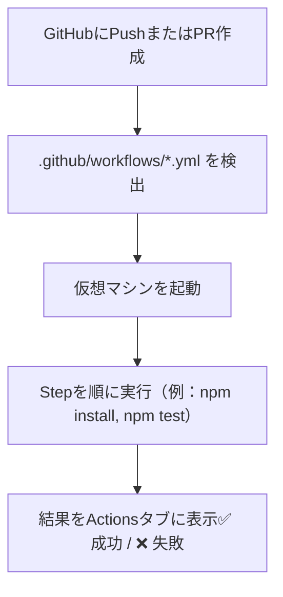

### はじめに

「GitHub Actions（GHA）って聞いたことあるけど、なんだか難しそう…」

そんな方のために、この記事では **超シンプルな Node.js プロジェクト**を作って、  
**GitHub に Push したら自動でテストが走る仕組み**を一緒に作っていきます！

> 🧪 作るもの：簡単な関数＋テスト

**📁 ディレクトリ構成**

```
my-project/
├── .github/
│   └── workflows/
│       └── test.yml   ← GitHub Actions設定ファイル
├── index.js           ← 関数の本体
├── index.test.js      ← テストファイル（Jest使用）
├── package.json
```

### 1\. プロジェクト作成

```bash
mkdir my-project
cd my-project
npm init -y
npm install --save-dev jest
```

`package.json` にスクリプト追加

```json
{
  "scripts": {
    "test": "jest"
  }
}
```

### 2\. サンプル関数を実装

```js:index.js
function add(a, b) {
  return a + b;
}

module.exports = { add };
```

### 3\. テストを書く

```js:index.test.js
const { add } = require('./index');

test('1 + 2 = 3', () => {
  expect(add(1, 2)).toBe(3);
});
```

### 4\. GitHub Actions を設定しよう

```yaml:.github/workflows/test.yml
name: Run Tests

on:
  push:
    branches: [main]
  pull_request:
    branches: [main]

jobs:
  test:
    runs-on: ubuntu-latest

    steps:
      - uses: actions/checkout@v3

      - name: Setup Node.js
        uses: actions/setup-node@v3
        with:
          node-version: 18

      - run: npm install
      - run: npm test
```

**🔑 ポイント**

| 用語     | 意味                                                   |
| -------- | ------------------------------------------------------ |
| Workflow | `.github/workflows/*.yml` にある設定ファイル           |
| Job      | 仮想環境で実行する処理のまとまり（1 つ以上のステップ） |
| Step     | 実行されるコマンドやアクション（1 行 1 行）            |
| Runner   | 実際に処理を実行する仮想マシン（Ubuntu など）          |

### 5\. GitHub に Push して動作確認！

```bash
git init
git add .
git commit -m "初回コミット"
git branch -M main
git remote add origin https://github.com/あなたのユーザー名/my-project.git
git push -u origin main
```

→ GitHub の「Actions」タブを開くと、自動的にテストが走っているのが確認できます。

**🧠 ポイント**

> - 基本的に GitHub 上で特別な設定は不要です！
> - **テストツールは Jest 以外でも OK！** Mocha や Vitest なども使えます。
> - **ブランチを制限したり、定期実行も可能** → `on:` をカスタマイズしよう
> - **もっとやりたい人へ：** Lint やフォーマッターも自動化できます！

### 補足：GitHub Actions の仕組み

#### 1. **GitHub にコードを Push する**

あなたがコードを `main` ブランチに Push したり、Pull Request を作る

#### 2. **GitHub が YAML ファイルを探す**

そのリポジトリに `test.yml` などの **ワークフローファイル** があるか自動でチェックします。

#### 3. **GitHub が仮想マシンを立ち上げる**

たとえば、

```yaml
runs-on: ubuntu-latest
```

と書いてあれば、**Ubuntu サーバー（仮想環境）** が起動されます。

#### 4. **YAML のコマンドを 1 行ずつ実行**

たとえばこう 👇

```yaml
- run: npm install
- run: npm test
```

→ 実際に `npm install` して `npm test` が実行される！

#### 5. **結果を GitHub 上に表示してくれる**

成功・失敗が「✅」「❌」で見えるようになります。

**🎨 イメージ図**



✅ 結論

> 「GitHub に Push するだけで、裏で GitHub がテスト環境を作って、勝手にコマンドを実行してくれる仕組み」

というのが、GitHub Actions のざっくりとした仕組みです！

### おわりに

GitHub Actions は最初は難しく見えるかもしれませんが、  
一度動くのを見ると、「これ、めちゃ便利じゃん！」となるはずです 😆

まずはこの記事をマネして、自動テストの第一歩を踏み出してみてください！
